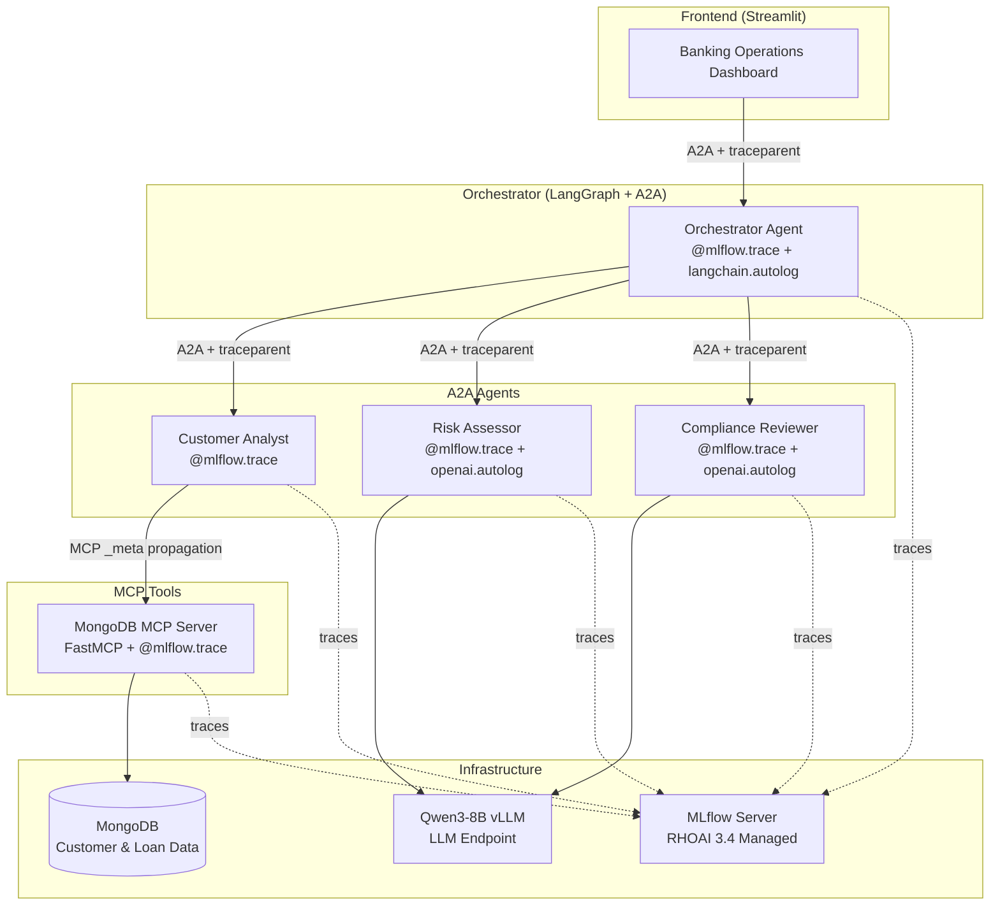

# Banking MLflow Tracing Demo on RHOAI 3.4

A banking-domain multi-agent system demonstrating MLflow 3.x tracing, evaluation, and observability on Red Hat OpenShift AI 3.4. Built to answer **Question 6** of the Enterprise Agentic Platform requirements.

## Architecture



### Trace Flow

Every user interaction produces a connected distributed trace:

```
User clicks "Run Assessment" in Dashboard
  └── orchestrator.assess_customer (AGENT, LangGraph workflow)
       ├── customer_lookup (CHAIN)
       │    └── customer_analyst.get_profile (AGENT)
       │         ├── customer_analyst.mcp_call (TOOL)
       │         │    └── tools/call get_customer → MongoDB query
       │         └── customer_analyst.mcp_call (TOOL)
       │              └── tools/call get_loan_history → MongoDB query
       ├── risk_assessment (CHAIN)
       │    └── risk_assessor.assess (AGENT)
       │         └── AsyncCompletions (CHAT_MODEL) → Qwen3-8B
       └── compliance_check (CHAIN)
            └── compliance_reviewer.review (AGENT)
                 └── AsyncCompletions (CHAT_MODEL) → Qwen3-8B
```

### Key Technologies

| Layer | Technology | Purpose |
|-------|-----------|---------|
| Agent Protocol | A2A SDK (Google) | Inter-agent communication via JSON-RPC |
| Agent Cards | `AgentCard` with skills | Agent discovery and capability declaration |
| Orchestration | LangGraph | Stateful workflow: lookup → risk → compliance |
| Tool Protocol | MCP (FastMCP) | MongoDB data access with trace propagation via `_meta` |
| LLM | Qwen3-8B via vLLM | Risk analysis + compliance review (tool-calling enabled) |
| Tracing | MLflow 3.x | Distributed tracing, evaluators, session tracking |
| Auth | kubernetes-namespaced | SA token-based MLflow access on RHOAI 3.4 |
| Frontend | Streamlit | Banking dashboard with assessment + chat |

## What It Does

A **Credit Risk Assessment & Compliance System** for banking operations:

1. **Customer Analyst** retrieves customer profile and loan history from MongoDB (via MCP)
2. **Risk Assessor** uses Qwen3-8B to analyze credit risk (DTI ratio, key factors, score)
3. **Compliance Reviewer** uses Qwen3-8B to verify against regulations (KYC, AML, DTI limits)
4. **Banking Assistant** provides multi-turn chat with session context about the assessment

All interactions generate MLflow traces with full input/output capture, connected across services via W3C traceparent.

## Deployment

### Prerequisites

- OpenShift cluster with RHOAI 3.4 installed
- MLflow operator enabled (`mlflowoperator.managementState: Managed`)
- MLflow CR deployed (see `k8s/mlflow-cr.yaml`)
- A vLLM model serving endpoint (Qwen3-8B or similar with tool-calling)

### One-Command Deploy

```bash
git clone https://github.com/gymnatics/MLFlow-Agent-Observability-Demo.git
cd MLFlow-Agent-Observability-Demo

# Login to your cluster
oc login --token=<token> --server=https://<api-server>

# Deploy everything
./deploy.sh
```

The script will:
1. Create the `mlflow-tracing-demo` namespace
2. Build container images via OpenShift BuildConfigs (from git)
3. Deploy MongoDB + seed banking data (10 customers, 12 loans)
4. Deploy MongoDB MCP server
5. Deploy all 4 A2A agents (orchestrator, customer-analyst, risk-assessor, compliance-reviewer)
6. Deploy the Streamlit dashboard with an OpenShift Route
7. Print the dashboard URL

### Other Deploy Options

```bash
./deploy.sh --build-only    # Just rebuild images (after code changes)
./deploy.sh --apply-only    # Just reapply k8s manifests
./deploy.sh --teardown      # Remove everything (namespace + images)
```

### Configuration

Edit `k8s/base/configmap.yaml` before deploying:

```yaml
# Point to your MLflow and LLM endpoints
MLFLOW_TRACKING_URI: "https://<rhoai-dashboard>/mlflow"
OPENAI_BASE_URL: "https://<vllm-endpoint>/v1"
LLM_MODEL: "<your-model-name>"
```

### Using Kustomize

```bash
# Apply all manifests declaratively
oc apply -k k8s/base/ -n mlflow-tracing-demo

# Or with a custom overlay
oc apply -k k8s/overlays/production/
```

## Project Structure

```
.
├── deploy.sh                      # One-command deployment script
├── run_demo.py                    # CLI demo runner (Acts 1-6)
├── evaluate.py                    # CLI evaluator runner
├── services/
│   ├── orchestrator/              # LangGraph orchestrator (A2A, port 8000)
│   │   ├── __main__.py            # A2A server + AgentCard
│   │   ├── agent_executor.py      # A2A bridge
│   │   ├── agent.py               # LangGraph workflow
│   │   ├── Dockerfile
│   │   └── requirements.txt
│   ├── customer-analyst/          # Calls MongoDB MCP (A2A, port 8001)
│   ├── risk-assessor/             # LLM risk analysis (A2A, port 8002)
│   ├── compliance-reviewer/       # LLM compliance checks (A2A, port 8003)
│   ├── mongodb-mcp/               # FastMCP wrapping MongoDB (port 8090)
│   └── frontend/                  # Streamlit dashboard (port 8501)
├── shared/
│   └── mlflow_bootstrap.py        # TracingMiddleware + traced_a2a_call + OTel bridge
├── k8s/
│   ├── base/
│   │   ├── kustomization.yaml     # Kustomize base
│   │   ├── configmap.yaml         # Environment configuration
│   │   ├── rbac.yaml              # ServiceAccount + mlflow-integration role
│   │   ├── frontend.yaml          # Dashboard Deployment + Service + Route
│   │   ├── agents/                # Agent Deployments + Services
│   │   └── mcp/                   # MongoDB + MCP Deployments
│   └── mlflow-cr.yaml             # MLflow CR for RHOAI 3.4
└── requirements.txt               # Local dev dependencies
```

## Demo Script

### Act 1: Multi-Agent Span Tracing
- Run assessment for customer C-1001 (Alice Tan, low risk)
- Open MLflow UI → show nested trace tree from orchestrator to MongoDB

### Act 2: Different Risk Profiles
- Run assessment for C-1006 (Frank Lee, high risk, delinquent loan)
- Compare traces side-by-side: different risk scores, different compliance flags

### Act 3: Multi-Turn Conversations
- Use the Banking Assistant chat to ask follow-up questions
- Open MLflow → Chat Sessions → show turns grouped by session_id

### Act 4: Evaluators on Traces
- Click "Run Evaluators on Traces" in the dashboard
- Show assessment traces scored by: regulatory_compliance, risk_data_grounding, assessment_sla
- Show chat traces scored by: helpfulness, factual_accuracy, chat_sla
- Open MLflow → trace → "Show assessments" to see scores attached

### Act 5: Metrics & Monitoring
- Show trace search/filtering in MLflow UI
- Demonstrate latency aggregation across traces
- Explain Prometheus/AlertManager integration for production alerts

### Act 6: Architecture Explanation
- SDK: `mlflow[kubernetes,genai]>=3.11` -- no OTel SDK or collector needed
- Collection: Traces sent directly to MLflow server via REST API
- Auth: `kubernetes-namespaced` plugin uses SA tokens automatically
- Propagation: TracingMiddleware (A2A) + FastMCP _meta (MCP) -- both W3C TraceContext

## Customer Question 6 Coverage

| Requirement | How Demo Addresses It |
|---|---|
| Trace data as spans | Nested trace tree: Orchestrator → Agents → MCP → DB → LLM |
| Multi-turn conversations | Chat sessions view with `session_id` grouping |
| Different agent types | Tool-calling (Customer Analyst), generation (Risk), validation (Compliance) |
| Define evaluators on traces | `make_judge()` with custom instructions, `@scorer` for code-based checks |
| Custom dashboard on trace store | MLflow search/filter API + Streamlit dashboard |
| Threshold and alerts | Latency SLA scorers + Prometheus integration path |
| Trace collection SDK | MLflow Python SDK -- no OTel SDK or collector needed |
| Central trace collection | MLflow server = trace store + evaluation engine + UI |
